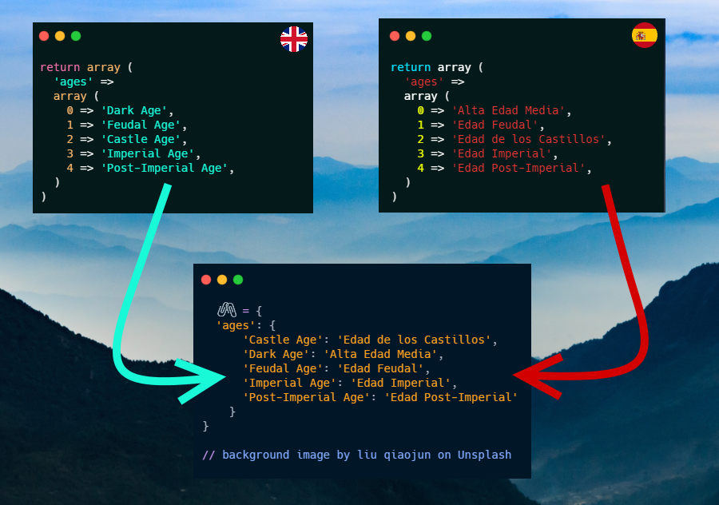
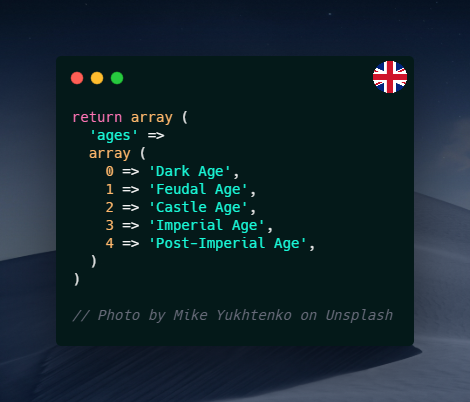
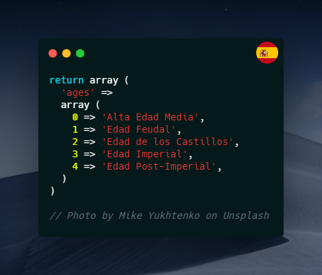
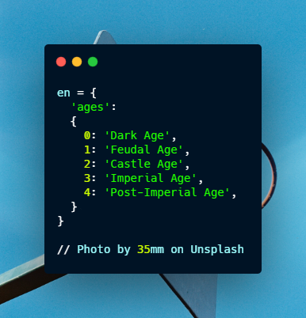
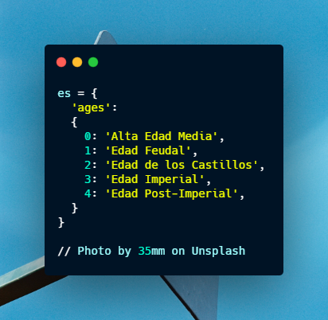
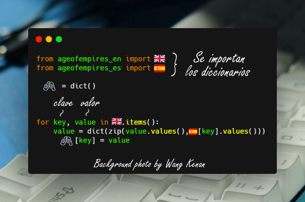
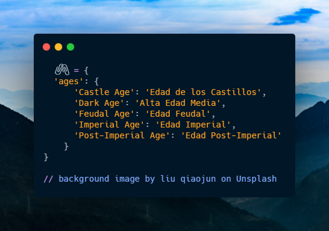

# Intercalador
Intercalador de datos usando de ejemplo dos diccionarios de Python 3.

## ¿Qué es esto?
Tan sólo un ejemplo de cómo intercalar datos, muy útil cuando se tienen archivos de traducción que apuntan a números pero necesitamos entremezclarlos para obtener cierta utilidad.

## ¿Cómo sería un caso real?
Uno de mis proyectos me llevó a hacer un intercalador, por lo tanto, expondré el caso real para realizar este ejemplo.

Tenemos dos arreglos, escritos en PHP.

**Nótese que uno está en ingés y el otro en español/castellano.**

---

Se transcodifica de PHP a Python.

---

Se escribe el código para intercalar los datos de cada diccionario.

---

Este es resultado al intercalar los datos solicitados (sólo pedimos los nombres, ignorando los números).

## Possible title names (of this repo) in English.
- Intercalator
- Interlayer
- Interleaver
- Interposer

## Recursos
- Banderas redondeadas - [countryflags.com](https://www.countryflags.com/)
- Fotos del código - [carbon.now.sh](https://carbon.now.sh/)
- Datos usados para el ejemplo - [github.com/goto-bus-stop/recanalyst](https://github.com/goto-bus-stop/recanalyst/)
- Banderas - [twemoji.maxcdn.com](https://twemoji.maxcdn.com/)